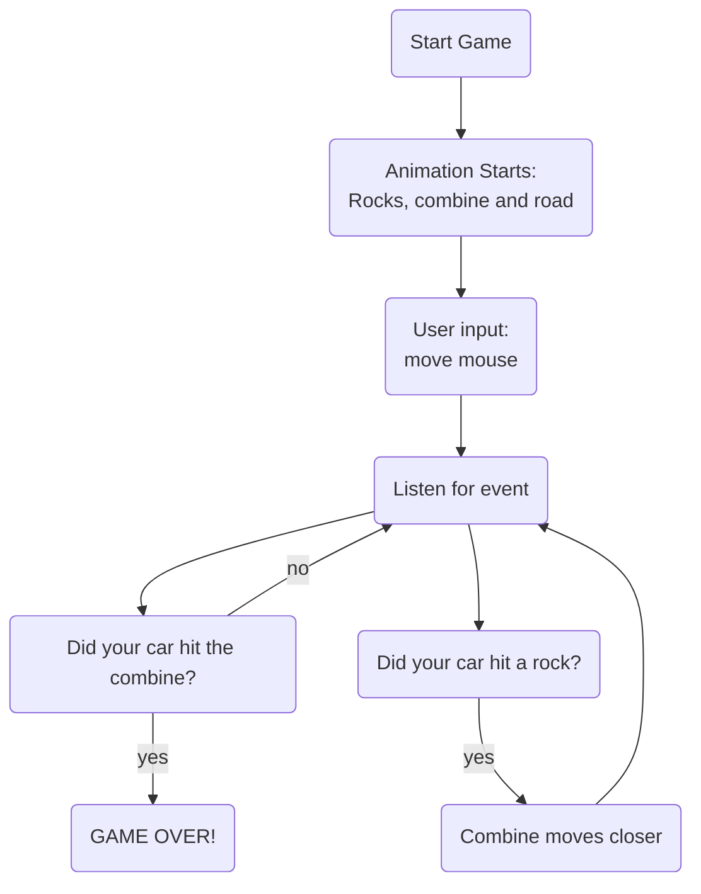
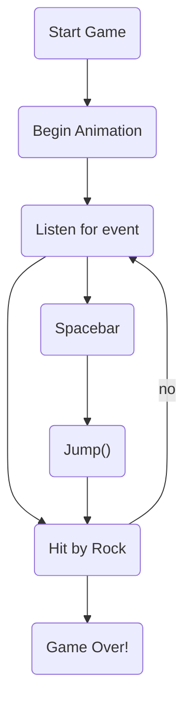

# Flow for SandRacer

```mermaid
graph TD
A(Start Game)-->B(Animation Starts:\n Rocks, combine and road)
B --> C(User input:\n move mouse)
C --> D(Listen for event)
D-->E(Did your car hit the combine?)
D --> F(Did your car hit a rock?)
E -->|no| D
E -->|yes| G(GAME OVER!)
F -->|yes| H(Combine moves closer)
H -->D

```
# Flow for DinoRush

```mermaid
graph TD
A(Start Game) --> B(Begin Animation)
B --> C(Listen for event)
C --> D(Spacebar)
C --> E(Hit by Rock)
D --> F("Jump()")
E --> G(Game Over!)
F --> E
E -->|no| C


```